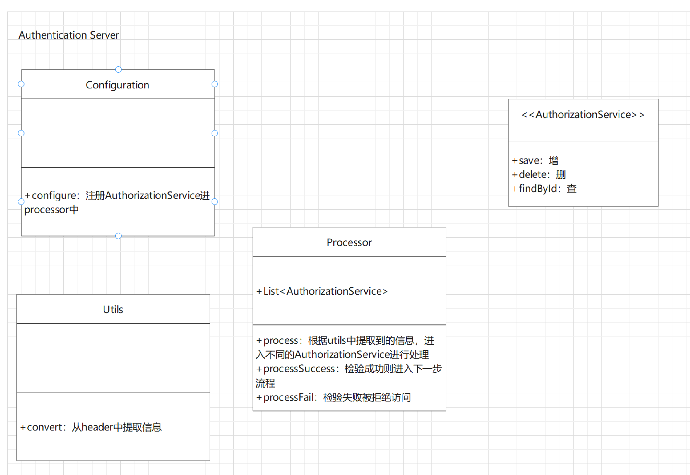
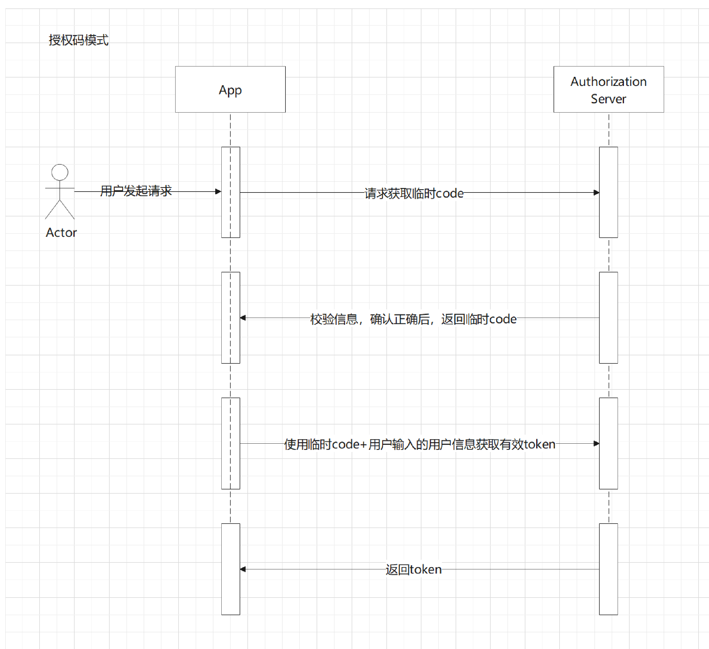
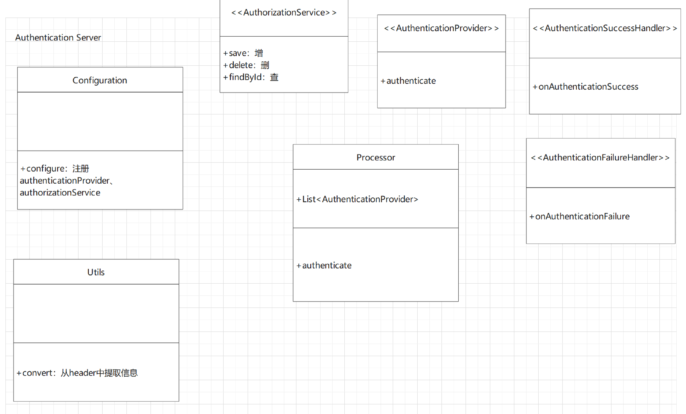

= 初识Spring Security

Spring Security中分为两种角色： Authentication Server和Resource Server。

Authentication Server负责提供认证能力，可以通过各种认证方式验证从被认证方传递过来的信息是否正确，以及向被认可的认证方发放正确令牌。

Resource Server可以理解为App的保护者，常规App在未开启认证前，所有接口都可以被自由访问。开启认证后，所有请求在进入接口前，会被容器的filters拦截，这些filters会对请求进行认证，认证不通过的请求通常会被重定向至登录页面。

---
了解这些基本机制后，我们来思考如何设计Spring Security。

首先，我们设计Authentication Server。思考一下，我们会发现：

1. Authentication Server需要很好的扩展性，以应对多种认证方式 ；
2. Authentication Server需要被很容易的开启，不需要配置过多参数；
3. 在完成2需求的同时，我们还需要让每一种认证方式能被任意改造；
4. Authentication Server需要和Resource Server进行通信，但通信的Resource Server要可以随意扩展。

如上的需求，我们思考后会发现：

1. 需求1只需要一个良好的设计模式就可以解决。
2. 需求2需要一个完善的configurer，在这个configurer中有足够的参数保证一旦开启可以被快速使用
3. 这也只需要良好的设计就可以完成
4. Authentication Server 和Resource Server在通信时，需要互相认证。

ok，有了以上简单的需求，我们开始设计Spring Security 中Authentication Server的一些框架。

Authentication Server启动时通过configuration将一系列AuthorizationService注册进processor中，后续通过修改configuration就可以保证认证方式的可扩展性。在请求到来时，app通过filter和utils的合作，将请求信息转换为认证信息，并通过processor认证。认证通过则放行。

***
梳理完基本流程后，我们开始向里面填充具体内容，也就是认证流程。

Spring Security提供了三种认证模式：

* 授权码模式（authorization code）
* OIDC模式（OpenID Connect Dynamic Client Registration）
* 客户端模式（client credentials）

`授权码模式`：
授权码模式是spring security中最重要的一种模式，也是从spring security从spring一部分到独立项目中一直维护的模式。

如图所示，用户访问app时，app作为Resource Server会首先向Authentication Server请求一个临时code；Authentication Server在确认该app是一个受保护app身份时，会发放一个具有有效时间并只可使用一次的临时code；app获取该code后，携带该code，并将用户重定向至登录页；用户在登录页中输入用户名密码等信息后，Authentication Server检验正确，则发放该用户的token。

这种模式的精妙之处在于首先确认app是否合法，这样可以拒绝掉很多无效的请 求，另外通过请求头中的临时code保证每个session登录都不同，可以做到页面登录的session级别控制。其次所有请求信息都是由app主动发起，Authentication Server作为回应者，无需记录过多关于app的信息，只需要确认app的合法性，这样可以将Authentication Server和Resource Server解绑。

`OIDC模式`：
OIDC模式和授权码模式很相似，只是返回的token信息中包含了用户信息和令牌有效期。该模式下，App在鉴别访问token是否合法时，可以不向Authentication Server询问，转而向OpenId提供者确认合法性。也就可以将grant token和check token功能分布到不同节点甚至是不同app上去。

`客户端模式`:
客户端模式较为简单，app携带client信息，访问Authentication Server，获取一个只含有client信息的token。

***

在了解上述三种认证模式后，我们设计的框架需要进一步调整，首先是processor需要多个，为了将process、processSuccess、processFail行为和processor解耦，需要将其抽象为接口，此外AuthorizationService作为负责存储认证信息的方法，需要考虑多种实现形式，包括内存、数据库、等等，根据ddd设计的理念，将其作为Repository层进行分解，保证domain和上层业务层不受下层存储介质的影响。

因此修改为如下：

在processor中有一系列的AuthenticationProvider，每一个都负责不同类型的校验逻辑，authenticate遍历列表中的所有provider，调用其authenticate方法。

当然这个processor在spring security源码中，叫做providerManager

